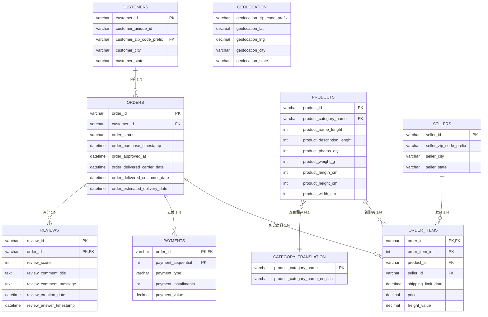

# Olist 巴西电商数据分析项目

> 用一份真实的电商订单数据，回答一个明确的业务问题——"留旧还是拉新"，并完整走一遍"数据入库 → 治理 → 分析 → 建模 → 可视化"的流程。
> 飞书文档：https://my.feishu.cn/docx/Nkgzd89Oxoe3WixduZacrwuhnXg

## 核心问题

> **Olist 平台 97% 的客户两年内只下单一次（复购率 3.0%），其中 48.5% 的高价值单次客贡献了 76% 的 GMV。这一"一次性买家主导"的收入结构，是市场结构使然（不可改），还是平台履约体验（超时、差评）所致（可改善）？平台资源该投"拉新"还是"留旧"，投给谁、如何投？**

完整逻辑链（描述 → 诊断 → 预测 → 处方）与假设重映射见 [docs/project_narrative.md](docs/project_narrative.md)。

| 层 | 要回答的问题 | 主要方法 | 产出 | 状态 |
|---|---|---|---|---|
| ① 描述 | 客户价值结构？谁贡献收入？ | 两阶段 RFM | [rfm_report.md](docs/rfm_report.md) | ✅ |
| ② 诊断 | 为什么 97% 只买一次？结构 vs 体验 | 画像(H1) + 评分→复购(H6) + 履约归因(H4/H5) + 大促(H2) + 品类(H3) | [hypothesis_log.md](docs/hypothesis_log.md) | ✅ |
| ③ 预测 | 谁会复购？谁在流失？ | LightGBM 复购预测（AUC=0.62） | 模型 + 特征重要性 | ✅ |
| ④ 处方 | 投拉新还是留旧？投谁、投多少？ | 预算分配 + 分人群运营动作 | [交互式仪表盘](dashboard/) | ✅ |

## 在线交互仪表盘

法一：部署到 GitHub Pages 后访问：`https://<你的用户名>.github.io/<仓库名>/dashboard/`
法二：直接访问：https://xymail0411-png.github.io/olist-dashboard/dashboard/

单文件 HTML + ECharts，6 个页面完整叙事：项目概览 → 经营总览 → 客户分层 → 为什么只买一次 → 预测模型 → 决策建议。

## 数据

- **来源**：Olist（巴西电商平台）官方发布的公开数据，Kaggle 托管
- **内容**：2016–2018 年 10 万+ 真实订单，9 张关系表（订单/客户/明细/支付/商品/评论/卖家/地理/类目），约 120MB
- **选它的原因**：真实、表间关系清晰、订单/支付/评论/物流齐备，足够支撑多维分析

## 数据模型

### ER 图（9 张表关系）



### 表结构说明

| 表 | 行数 | 一句话说明 | 主键 |
|---|---|---|---|
| customers | 99,441 | 客户维度（customer_id 每单一个，unique_id 才是一个人）| customer_id |
| orders | 99,441 | 订单主表，5 个时间戳构成完整履约链路 | order_id |
| order_items | 112,650 | 订单明细，一单可多商品、多卖家 | (order_id, order_item_id) |
| payments | 103,886 | 支付记录，一单可分多次付 | (order_id, payment_sequential) |
| products | 32,951 | 商品维度（类目/重量/尺寸）| product_id |
| reviews | 99,224 | 1-5 星真实评价 + 评语 | (review_id, order_id) |
| sellers | 3,095 | 卖家维度（平台上有几千个独立卖家）| seller_id |
| geolocation | 1,000,163 | 邮编→经纬度（无天然唯一键）| 无 |
| category_translation | 71 | 类目葡语→英语翻译 | product_category_name |

### 建表思路（为什么这样设计）

1. **主键用 VARCHAR(32) 不用 INT**：真实 ID 是 32 位十六进制字符串，存成数字会溢出且语义丢失
2. **金额用 DECIMAL(10,2) 不用 FLOAT**：浮点运算会有精度误差，算钱必须精确到分
3. **复合主键处理脏数据**：review_id 在原始数据里有 814 个重复（同一评论关联多订单），用 (review_id, order_id) 做主键保证唯一——验证数据时发现的坑，直接体现在表结构里
4. **允许空值贴合真实**：未送达订单的送达时间为空，列不设 NOT NULL，否则导入直接失败
5. **外键约束拦截脏数据**：订单必须属于存在的客户、明细必须指向存在的商品/卖家，数据库层把关
6. **utf8mb4 字符集**：评论含巴西葡语字符，默认编码会变乱码
7. **规范化拆表**：订单与明细分开，避免一单多商品时订单信息重复存储


## 技术栈

Python（pandas / scikit-learn / LightGBM）+ MySQL 数据仓库 + Tableau / ECharts 可视化 + GitHub Pages 部署。

## 我做了什么

1. ✅ 数据集下载与完整性验证（9 张表行数、空值、外键一致都查过）
2. ✅ 数据治理：清洗、定义指标口径（有效订单/用户/GMV）、处理已知问题
3. ✅ EDA：经营总览、时间趋势、品类结构、地理分布、履约时效、评论评分
4. ✅ RFM 两阶段分层（单次层 R×M 4 类 + 复购层 R×F×M 8 类）+ 用户画像
5. ✅ 6 个假设检验（H1~H6），逐项验证"结构说 vs 体验说"
6. ✅ 复购预测模型（LightGBM，AUC=0.62，Top10% 抓 21% 复购）
7. ✅ Tableau 经营健康度看板 + ECharts 交互式仪表盘（6 页完整叙事）
8. ✅ 决策建议（拉新 80% / 留旧 20%，分人群运营动作）

## EDA 假设与验证计划（假设驱动框架）

EDA 只回答"发生了什么"，结论要进入业务建议必须经过"假设 → 验证"。以下把 6 大发现升级为可证伪假设，逐项验证后闭环：

| 假设 | 可证伪表述（源自 EDA 发现） | 验证方法 | 结论 |
|---|---|---|---|
| **H6** | 超时订单评分显著低于准时（4.29 vs 2.46）；高评分客户复购率更高 | t 检验 + 评分-复购相关性 | 超时确实让客户不满，但评分高低与复购率无关（p=0.44）——复购是结构性问题 |
| H1 | 复购客户与单次客户在客单价、品类、地区分布上存在显著差异 | Mann-Whitney U + 效应量 | 复购客跨 1.62 品类 vs 单次客 1.01（r=0.56），客单价 R$308 vs R$161 |
| H4 | 超时与跨州距离相关 | 客户州 × 卖家州时效拆解 | 同州超时 5.42% vs 跨州 8.81% |
| H5 | 超时集中在特定州 | 州维度超时率拆解 | 东北部 AL 23% vs 东南部 SP 4.5% |
| H2 | 大促订单的客单价、超时率、差评率劣于日常 | 黑五 vs 日常对比 | 客单价无差异（R$158 vs R$160），超时率翻倍（13.4% vs 7.1%） |
| H3 | 品类存在"量大价低 / 量小价高"的量价组合差异 | 品类散点图 | office furniture 量少价高（R$382），bed bath 量大价低（R$154） |

> 完整重映射（含新增的"低分评语文本挖掘"与"增长分解"两个证据）见 [docs/project_narrative.md](docs/project_narrative.md)。

## 方案层信度与验证设计

> ⚠️ **信度边界**：本分析基于 Olist 公开数据集，**只能证明"相关/可预测"，不能证明"因果"**（数据集无营销渠道、价格历史、竞品、促销日历数据，未做 A/B 实验）。"复购率低为结构性问题"是 H1~H6 统计检验、增长分解与复购模型共同支撑的**推断**，而非实验证明。

**方案层为可证伪假设**：拉新 80% / 留旧 20% 与分人群运营动作，是"基于分析的建议"，真实效果需经投放验证。

**A/B 验证设计（落地路径）**：

- **假设**：对高潜新客在首购 30 天内发放复购券 / 定向召回，目标人群复购率显著提升，且留旧池 ROI > 1
- **设计**：随机分组（实验/对照）｜主指标：复购率、留旧 ROI｜次要指标：客单价、GMV 增量｜样本量：按 3% 基线复购率与最小效应量估算｜周期：≥30 天完整购买窗口｜决策阈值：ROI>1 保留留旧池，否则收缩回拉新｜防污染：避开大促窗口、不与自然促销重叠
- **闭环**：30 天窗滚动打分 → 投放 → 追踪复购 → 回算 ROI → 反馈预算与模型

**反事实基线**：留旧增量 = 实验组 GMV 增量 − 对照组自然增长；若只投拉新不投留旧，GMV 预期维持新客驱动现状，留旧增量需显著高于该基线才值得保留。

**业务场景边界**：数据集无法识别渠道缩减/自然衰减、价格策略、竞品冲击、库存限制等外部因素；黑五等大促脉冲已通过 H2 单独识别，其余正常波动需结合业务背景判断，避免将正常波动误判为业务问题。

## 运行

```bash
pip install -r requirements.txt
python scripts/validate_data.py        # 数据完整性验证
python scripts/11_dashboard_data.py   # 重新生成仪表盘数据 JSON
```

仪表盘直接用浏览器打开 `dashboard/index.html`，无需服务器。
---

*数据版权归 Olist 所有（CC BY-NC-SA 4.0），本仓库仅用于个人学习与作品集展示。*
