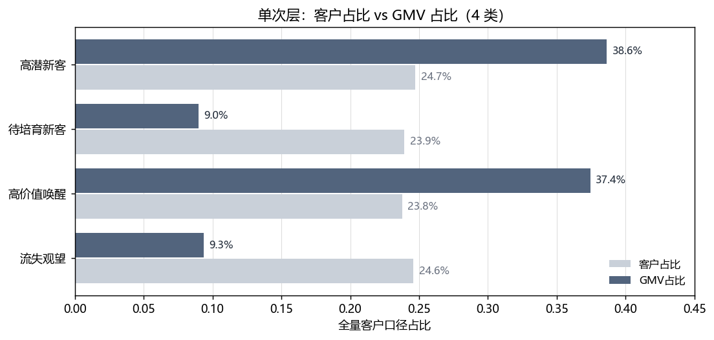
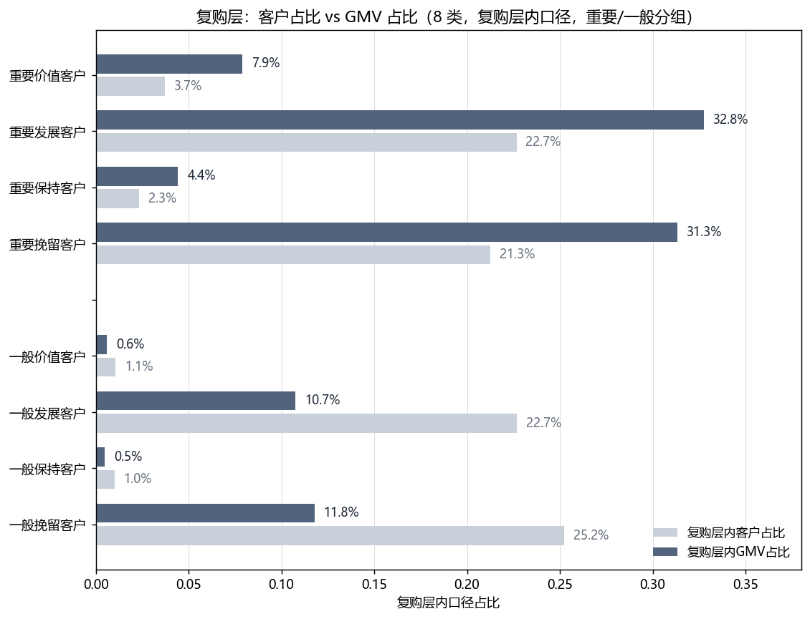
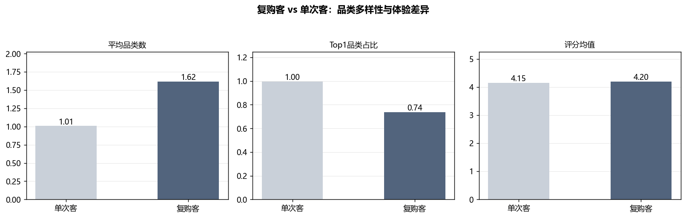

# RFM 客户分层分析报告

> **分析对象**：Olist 巴西电商平台 2017-01 至 2018-08 有效订单（delivered）
> **客户口径**：customer_unique_id，共 93,358 人
> **GMV 口径**：订单明细 price + freight 求和
> **R 基准日**：2018-08-31

---

## 一、研究问题

EDA 阶段发现一个反常事实：平台复购率仅 3.0%——97% 的客户在两年内只下单一次。这意味着平台收入几乎全部依赖"一次性买家"，客户关系极其脆弱。

由此引出本报告要回答的问题：

1. **谁是高价值客户？**——收入到底由谁贡献？
2. **价值结构长什么样？**——各层客户的规模和贡献是否对称？
3. **运营资源该投向谁？**——如果 97% 的人只买一次，拉新和留旧哪个更值得投？

本报告用 RFM 模型回答前两个问题，第三个问题由后续复购预测模型和决策报告承接。

---

## 二、方法选择：为什么不用经典 RFM，而用两阶段方案

### 2.1 经典 RFM 的前提

经典 RFM 对 R（最近购买）、F（购买频次）、M（消费金额）三个维度分别按中位数切"高/低"，交叉得到 2×2×2=8 类客户。这个方法隐含一个统计前提：**每个维度的人群分布有梯度，中位数能把人群切成两个均衡且有区分度的半区**。

### 2.2 本数据的问题

对 93,358 个客户计算三个维度的中位数二分效果：

| 维度 | 中位数切分后"高分组"占比 | 是否均衡 |
|---|---|---|
| R（距上次购买天数 ≤ 218 天） | 50.2% | 均衡，正常 |
| M（消费金额 > 107.78 元） | 50.0% | 均衡，正常 |
| F（订单数 > 1 单） | **3.0%** | **退化** |

F（频次）出了问题：97% 的客户订单数等于 1，中位数就是 1。"F > 中位数"等价于"F > 1"，只能抓住 3% 的复购客户，对 97% 的单次客户完全没有区分能力。这在统计上叫**地板效应（floor effect）**——数据堆在最小值上，分位数切不开。

这个退化还带来两个连锁问题：

- **M 与 F 共线**：对单次客户，M = 客单价 × 1 单。"高 M"其实就是"这一单买得贵"，RFM 想测的"粘性"（F）和"钱包份额"（M）在单次客身上分不开。
- **8 类名不副实**：经典 RFM 里需要 F=1 的四层（重要价值/保持/一般价值/一般保持）加起来正好是那 3% 的复购客。"重要价值客户"被窄化成了"近期活跃的复购客"，对单次客中的高价值客户视而不见。

### 2.3 两阶段方案

既然 F 维度在 97% 的人身上没有区分度，就不应该硬拿它去切所有人。改进思路是**先承认数据自己显示的结构分界，再在每一层内部用有区分度的维度**：

- **阶段一**：按 F=1 vs F≥2 切成"单次客户"和"复购客户"两层。这不是人为发明的分类，而是数据本身显示的结构断层。
- **阶段二·单次层**：F 恒等于 1，没有任何信息量，剔除。退化成 R×M 两个维度，分 4 类。
- **阶段二·复购层**：F 有 2~15 单的真实差异，可以参与分层。但复购层内部 91.8% 的人也挤在 F=2，中位数仍然切不开，所以 F 改用业务档 F≥3（即"复购深度"），配合 R×M 分 8 类。

切分点：单次层 R≤218 天、M>105.38；复购层 R≤198 天、M>225.55、F≥3。

---

## 三、阶段一：单次 vs 复购的结构分界

| 层 | 客户数 | 客户占比 | GMV 占比 |
|---|---|---|---|
| 单次购买（F=1） | 90,565 | 97.0% | ~94.4% |
| 复购客户（F≥2） | 2,793 | 3.0% | ~5.6% |

复购率 3.0% 是整个分析的出发点：绝大多数客户停留在第一次购买，平台收入建立在"持续拉新"而非"客户留存"之上。这个结构决定了后面所有分析的基调——单次层才是主战场。

---

## 四、单次层分析：谁贡献了收入

### 4.1 分层结果

单次层 90,565 人按 R（近期 vs 沉睡）和 M（高额 vs 低额）交叉分 4 类：

| 类别 | 定义 | 客户数 | 客户占比 | GMV 占比 | 人均消费 |
|---|---|---|---|---|---|
| 高潜新客 | 近期 × 高额 | 23,028 | 24.7% | 38.6% | R$258 |
| 高价值唤醒 | 沉睡 × 高额 | 22,122 | 23.8% | 37.4% | R$260 |
| 待培育新客 | 近期 × 低额 | 22,274 | 23.9% | 9.0% | R$62 |
| 流失观望 | 沉睡 × 低额 | 22,891 | 24.6% | 9.3% | R$63 |

### 4.2 图 1 解读

**图 1　单次层 4 类客户占比 vs GMV 占比（全量口径）**

**观察**：四类客户的人数几乎完全均等（各约 24%），但 GMV 贡献呈两极分化。高潜新客和高价值唤醒两类以合计 48.5% 的客户贡献了 76.0% 的 GMV；待培育新客和流失观望两类以 48.5% 的客户只贡献了 18.3% 的 GMV。高额组的人均消费（约 R$259）是低额组（约 R$63）的 4 倍。

**分析**：这说明单次客户的价值差异完全由"客单价"驱动，而非购买频次（因为每个人都只买一次）。同样是一次性购买，有人花 R$260，有人只花 R$63——这背后是品类选择的差异（高额组买的是 health_beauty、bed_bath_table 等高客单品类，低额组买的是低价小件）。R 维度（近期 vs 沉睡）在两类之间基本均衡，说明"沉睡"不是低价值的代名词——高价值唤醒客户虽然距上次购买超过 218 天，但他们的客单价和高潜新客几乎一样（R$260 vs R$258）。

**结论**：单次层的运营重心非常明确——高额的两类（高潜新客 + 高价值唤醒）占了近八成收入，是必须守住的基本盘。其中高潜新客近期活跃、只买了一次，是复购转化最有希望的目标人群；高价值唤醒虽然客单价高但已经沉睡，是最大的流失风险点。低额两类（待培育 + 流失观望）合计近半客户但只贡献不到两成收入，不应投入太多运营资源。

---

## 五、复购层分析：谁是忠诚客户

### 5.1 分层结果

复购层 2,793 人（3.0%）按 R×F×M 分 8 类，再按 M 高低归为"重要"（高额）和"一般"（低额）两组：

| 类别 | 客户数 | 层内客户占比 | 层内 GMV 占比 | 人均消费 | 人均订单 |
|---|---|---|---|---|---|
| 重要价值客户 | 106 | 3.7% | 7.9% | R$182 | 3.7 单 |
| 重要发展客户 | 643 | 22.7% | 32.8% | R$222 | 2.0 单 |
| 重要保持客户 | 67 | 2.3% | 4.4% | R$185 | 3.2 单 |
| 重要挽留客户 | 602 | 21.3% | 31.3% | R$227 | 2.0 单 |
| 一般价值客户 | 30 | 1.1% | 0.6% | R$57 | 3.0 单 |
| 一般发展客户 | 639 | 22.7% | 10.7% | R$73 | 2.0 单 |
| 一般保持客户 | 28 | 1.0% | 0.5% | R$49 | 3.2 单 |
| 一般挽留客户 | 711 | 25.2% | 11.8% | R$72 | 2.0 单 |

### 5.2 图 2 解读

**图 2　复购层 8 类客户占比 vs GMV 占比（复购层内口径，重要/一般分组）**

**观察**：复购层内部同样呈"高额主导"结构。重要发展客户以 22.7% 的人贡献 32.8% 的 GMV，重要挽留客户以 21.3% 的人贡献 31.3% 的 GMV——两类合计 44% 的人贡献了 64% 的复购层 GMV。相比之下，一般发展和一般挽留合计 48% 的人只贡献 22.5% 的 GMV。重要价值和重要保持两类虽然人均消费高（R$182~185），但人数极少（各约 100 人），对整体贡献有限。

**分析**：复购层的结构和单次层惊人地一致——价值集中在高客单价客户身上。这说明"高客单价"不是某个客户群的偶然特征，而是贯穿整个平台的价值驱动因素。另一个值得注意的点：复购层里 F≥3（复购深度 3 单以上）的客户（重要价值 + 重要保持 + 一般价值 + 一般保持）加起来只有 231 人，占复购层的 8.3%。也就是说，绝大多数复购客只买了 2 单就停了，真正的"高频忠诚客户"非常稀少。

**结论**：复购层的运营重点是"重要发展"和"重要挽留"两类——他们人数最多、贡献最大，且客单价高（R$222~227）。这两类客户刚完成第二次购买，是最容易转化为第三单、第四单的窗口期。重要价值客户（3.7% 人数、人均 3.7 单）虽然规模小，但他们是真正的高频忠诚客户，值得用 VIP 权益单独维护。

---

## 六、复购客画像：他们和单次客有什么不同

分层回答了"谁有价值"，但要回答"为什么复购"，还需要直接对比复购客和单次客的特征差异。

### 6.1 图 3 解读

**图 3　复购客 vs 单次客：品类多样性与体验差异**

**观察**：三个子图对比了单次客和复购客在品类和体验上的差异：

- **平均品类数**：单次客 1.01 个，复购客 1.62 个。复购客平均跨 1.6 个品类下单，而单次客几乎只买 1 个品类。
- **Top1 品类占比**：单次客 100% 集中在第一个品类（因为只买一次），复购客只有 74% 的订单集中在 Top1 品类，剩余 26% 分散在其他品类。
- **评分均值**：单次客 4.15 分，复购客 4.20 分。差异很小（0.05 分），不构成显著区分。

**分析**：唯一有实质区分度的维度是**品类多样性**。复购客不是因为"体验更好"才回来的——评分差异微乎其微。他们回来是因为他们在平台上购买了多个品类，跨品类购买本身就是复购行为的外在表现。这和 H1 假设检验的结论一致：品类数差异的效应量 r=0.56（大效应），而客单价、评分、超时率的效应量都接近零。

**结论**：复购的核心驱动不是履约体验，而是客户是否愿意跨品类探索。这对运营的启示是：促复购不应该只靠"发优惠券"，而应该引导客户发现新的品类——比如买了 health_beauty 的客户推荐 bed_bath_table，利用跨品类推荐打破"一次购买一个品类"的行为惯性。

---

## 七、核心发现汇总

| # | 发现 | 数据支撑 | 运营含义 |
|---|---|---|---|
| 1 | 97% 客户只买一次，收入靠新客驱动 | 复购率 3.0%，GMV 97% 来自新客首单 | 拉新是增长基本盘，留旧是补充 |
| 2 | 单次层价值高度集中在高额两类 | 48.5% 客户贡献 76% GMV | 运营资源聚焦高潜新客 + 高价值唤醒 |
| 3 | 高潜新客是复购转化首选目标 | 近期活跃 × 高额 × 仅一次购买 | 首购后 30 天内做复购激励 |
| 4 | 高价值唤醒是最大流失风险 | 22,122 人沉睡但客单 R$260 | 定向召回，防止高额客户流失 |
| 5 | 复购层价值同样由高额客户主导 | 重要发展+挽留 44% 人贡献 64% GMV | 复购运营聚焦高额复购客 |
| 6 | 品类多样性是复购的核心特征 | 复购客 1.62 品类 vs 单次客 1.01 | 跨品类推荐比优惠券更有效 |

---

## 八、改进前后对比

| 维度 | 原方案（经典中位数二分 8 类） | 两阶段方案 | 提升 |
|---|---|---|---|
| F 维度处理 | 97% 客户 F=1，"F>1"只抓 3%，退化为"是否复购" | 单次层剔除 F；复购层用业务档 F≥3 | F 只在有区分度的层内参与 |
| 单次客户分类 | 被塞进 8 类中的 4 类，标签名不副实 | 独立成层，R×M 分 4 类，业务含义清晰 | 每层直接对应一个运营动作 |
| 目标人群识别 | "重要价值客户"= 1.5% 的复购客 | "高潜新客"= 24.7% 的单次高额活跃客 | 复购预测的目标人群规模和清晰度都提升 |
| M 与 F 共线 | 单次客 M=客单×1，M 和 F 信息重叠 | 单次层只用 R×M，不混入无效 F | 消除共线导致的伪区分 |
| 统计合理性 | 对右偏计数分布强制中位数二分 | 先切结构断层，再在层内选择有梯度的维度 | 切分点有业务依据，可复现可解释 |

---

## 九、下一步

本报告完成了"描述"层——回答了谁有价值、价值结构如何。后续分析沿以下方向推进：

1. **诊断层**：验证复购率低是结构性原因（市场特征）还是体验性原因（履约问题），通过 H1~H6 假设检验完成。
2. **预测层**：以"是否复购"为标签，用首单特征训练分类模型，量化预测能力，识别高潜客户。
3. **处方层**：基于描述+诊断+预测的结论，给出"拉新 vs 留旧"的预算分配和分人群运营方案，落地为经理仪表盘。
